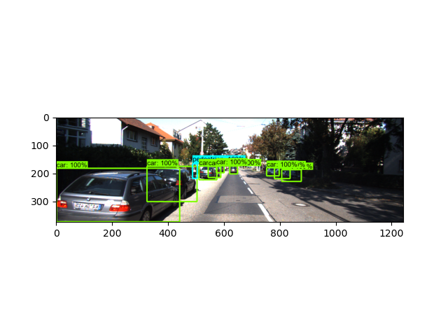
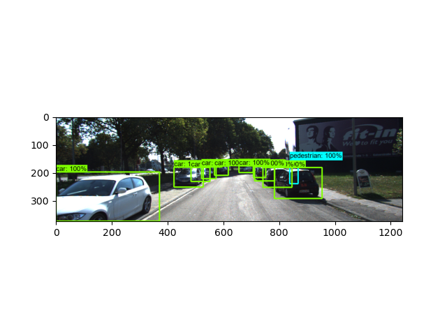
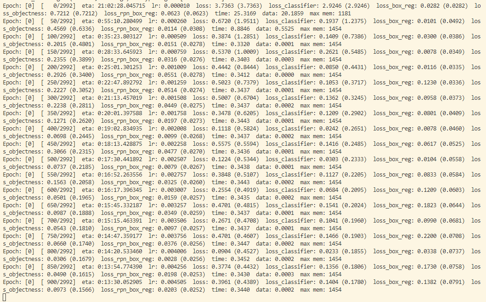

# Faster_RCNN on KITTI

## Contents  
- [Environment](#Environment)  
- [Structure](#Structure)  
- [Pretrain weight download address](#Pretrain-weight-download-address)
- [Dataset](#Dataset)   
- [Training](#Training)
- [Dataloader results](#Dataloader-results) 
- [Training process](#Training-process) 
- [Copyright](#Copyright) 

## Environment
* Python3.6/3.7/3.8
* Pytorch1.7.1(Note: It must be 1.6.0 or above, because it is only supported after using the official mixed precision training 1.6.0)
* pycocotools(Linux:```pip install pycocotools```; Windows:```pip install pycocotools-windows```(No additional installation of VS Code)
* Ubunt or Centos (Windows)
* Better use GPU to train

## Structure

  ├── [backbone](./backbone): Feature extraction network, you can choose according to your requirements  
  ├── [network_files](./network_files): Faster R-CNN network (including modules such as Fast R-CNN and RPN)  
  ├── [train_utils](./train_utils): Training and validation related modules (including cocotools)  
  ├── [my_dataset_1.py](./my_dataset_1.py): Custom dataset is used to read the KITTI dataset  
  ├── [train_mobilenetv_1.py](./train_mobilenetv_1.py): Training with MobileNetV2 as backbone   
  └── [pascal_voc_classes.json](./pascal_voc_classes.json):pascal_voc_classes.json: pascal_voc tag file  

## Pretrain weight download address
* put it in the backbone folder after downloading
* [MobileNetV2 backbone](https://download.pytorch.org/models/mobilenet_v2-b0353104.pth)
* [ResNet50+FPN backbone](https://download.pytorch.org/models/fasterrcnn_resnet50_fpn_coco-258fb6c6.pth)
* Note that the downloaded pretrain weights should be renamed, for example, what is read in train_resnet50_fpn.py is```fasterrcnn_resnet50_fpn_coco.pth```,
  not```fasterrcnn_resnet50_fpn_coco-258fb6c6.pth```

## Dataset
* We use the KITTI dataset
* [Image dataset](https://s3.eu-central-1.amazonaws.com/avg-kitti/data_object_image_2.zip)
* [label dataset](https://s3.eu-central-1.amazonaws.com/avg-kitti/data_object_label_2.zip)

## Training
* Make sure to prepare the dataset in advance
* Make sure to download the corresponding pretrain weights in advance
* Modify the relative paths of datasets and preset weights in the code.
* Check if the [Dataloader](./my_dataset_1.py) is functioning properly. Uncomment the last two lines.
```
plt.imshow(img)
plt.show()
```
* To train mobilenetv2+fasterrcnn, use the [train_mobilenetv_1.py](./train_mobilenetv_1.py) training script directly
* To train resnet50+fpn+fasterrcnn, use the train_resnet50_fpn.py training script directly
* To use multi-GPU training, use the ```python -m torch.distributed.launch --nproc_per_node=8 --use_env train_multi_GPU.py``` command, the ```nproc_per_node```` parameter is the number of GPUs to use
* If you want to specify which GPU devices to use, you can add ````CUDA_VISIBLE_DEVICES=0,3``` before the command (for example, I only need to use the 1st and 4th GPU devices in the device)
* ```CUDA_VISIBLE_DEVICES=0,3 python -m torch.distributed.launch --nproc_per_node=2 --use_env train_multi_GPU.py```

## Dataloader results



## Training process


- [x] Dataloader
- [ ] Training
- [ ] Optimization

## Copyright
* For more information about the project and the analysis of the Faster RCNN code, please refer to [BiliBili](https://b23.tv/HvMiDy)
* Changes based on this [Github project](https://github.com/WZMIAOMIAO/deep-learning-for-image-processing.git)
* This project is mainly from the source code in the official torchvision module of pytorch
find here [pytorch](https://github.com/pytorch/vision/tree/master/torchvision/models/detection)